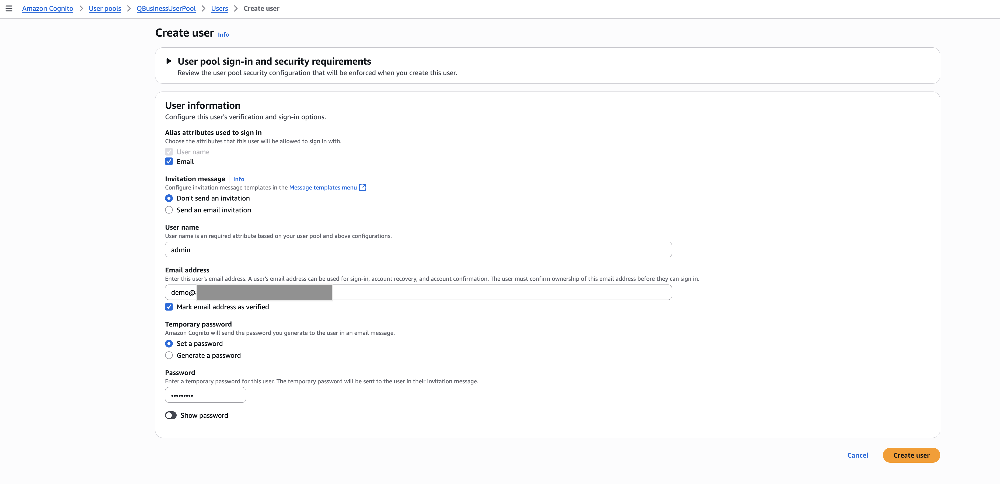
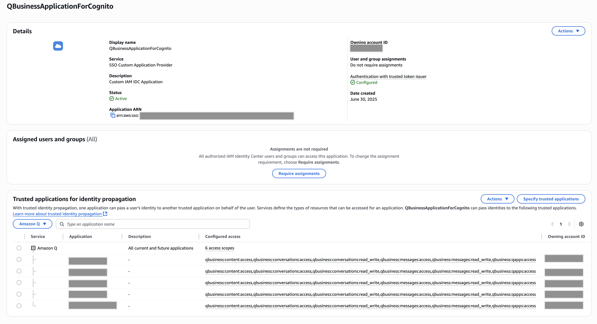

# Amazon Q Business Tools

A comprehensive suite of tools for monitoring, analyzing, and enhancing your Amazon Q Business experience. This application provides administrators and developers with powerful capabilities to troubleshoot observability issues, manage data sources, evaluate performance, and interact with Amazon Q Business services

## Project Structure

The project is organized into three main directories:

### Frontend

The frontend is a React single-page application (SPA) built with TypeScript, providing a modern and responsive user interface for interacting with Amazon Q Business services.

- **Technologies**: React, TypeScript, TailwindCSS
- **Key Features**: Operations Dashboard, Unified Search, AI Chat Bot, Ground Truth Evaluation
- **Directory**: `/frontend`

### Backend

The backend is a Python-based API service that handles interactions with AWS services and provides the necessary endpoints for the frontend.

- **Technologies**: Python, Flask
- **Key Services**: AWS Client Utils, Bedrock Service, CloudWatch Service, DynamoDB Service, Q Business Service
- **Directory**: `/backend`

### Infrastructure

The infrastructure code uses AWS CDK to deploy the application to AWS, setting up all necessary resources including S3, CloudFront, ECS, and more.

- **Technologies**: AWS CDK, TypeScript
- **Key Components**: Backend Stack, CloudFront Stack, Cognito Stack, IAM Identity Center Stack
- **Directory**: `/infra`

## Features

### Authentication

The application supports multiple authentication methods:

- **AWS Credentials**: Direct access using AWS Access Key ID and Secret Access Key
- **Amazon Cognito**: User authentication through Amazon Cognito User Pools
- **Microsoft Entra**: Authentication using Microsoft Entra ID (formerly Azure Active Directory)
- **Anonymous Access**: Limited access using an IAM Role for API invocation

### Operations Dashboard

Monitor, analyze, and troubleshoot your Amazon Q Business data source sync jobs with powerful insights and visualizations.


The Operations Dashboard includes the following tabs:

#### Sync Metrics

This tab shows metrics emitted in CloudWatch for the configured application and the last sync run. It provides insights into the performance and health of your sync jobs.

#### ACL Viewer

This tab allows you to visualize all the documents that were crawled during the last sync run. For each document, it lists all the ACLs associated with it, which might include Local Groups, Global Groups, and Users.

#### Access Checker

This tab allows you to check if a given document can be accessed by a provided user. It uses the check-document-access API to determine whether a user should have access to a document.

#### Sync Errors

This tab shows all the sync errors during the last configured sync. It lists all the errors, status codes, and possible reasons, helping you troubleshoot issues with your data source connectors.

### Unified Search

Search for content with an integrated Generative AI assistant to help you find exactly what you need. This feature combines traditional document search with AI-powered responses.

Key capabilities:
- AI-powered responses to search queries
- Document search with filtering capabilities
- Interactive chat functionality
- Application selection for different data sources

### AI Chat Bot

Chat with an AI assistant using customizable data sources to get intelligent, context-aware responses. The AI Chat Bot allows you to select either plugins or data sources to enhance your chat experience:

- **Plugins**: Extend the functionality of the chat bot with specialized capabilities
- **Data Sources**: Connect to your organization's data to provide context-aware responses

Note that plugins and data sources cannot be used simultaneously - you must choose one or the other for each chat session.

### Ground Truth Evaluation

Evaluate Q Business performance against ground truth datasets with an intuitive interface. This tool helps you assess the quality of responses from Amazon Q Business by comparing them against known ground truth.

The evaluation process involves:
1. **Upload Data**: Upload your ground truth dataset in CSV format
2. **Configure QBusiness**: Set up the connection to your Amazon Q Business application
3. **Evaluate**: Run the evaluation against your ground truth data
4. **Results**: View and analyze the evaluation results

#### Ground Truth Dataset Format

The ground truth dataset must be uploaded as a CSV file with the following specifications:

- **Required Columns**:
  - `prompt`: Contains the query or question text that will be sent to Amazon Q Business
  - `groundTruth`: Contains the expected correct response for comparison

- **File Requirements**:
  - File format: CSV (Comma-Separated Values)
  - Maximum file size: 10MB
  - Rows with empty prompt fields will be automatically filtered out

Example CSV format:
```
prompt,groundTruth
"What is Amazon Q Business?","Amazon Q Business is an AI-powered assistant designed for workplace use that can answer questions, generate content, and complete tasks."
"How do I configure a data source?","To configure a data source, navigate to the Amazon Q Business console, select Applications, choose your application, and click on Data sources to add a new connector."
```

Template files are available for download within the application to help you get started with the correct format.

## Getting Started

### Prerequisites

- AWS Account with access to Amazon Q Business
- AWS Credentials (Access Key ID, Secret Access Key, and optionally Session Token)
- Amazon Q Business Application set up with at least one index and data source
- Node.js and npm installed for frontend development
- Python 3.8+ installed for backend development
- AWS CDK installed for infrastructure deployment

### Infrastructure Stacks

The application is deployed using multiple AWS CDK stacks that work together:

#### QBusinessBackendStack (Backend Stack)

This stack creates the backend infrastructure for the application, including:

- VPC with public and private subnets
- ECS Cluster with Fargate service running the backend container
- Application Load Balancer (ALB) with security groups
- IAM roles for task execution and service permissions
- CloudWatch logs for monitoring
- Secret for origin verification between CloudFront and ALB

**Key Exports:**
- `LoadBalancerDnsName`: The DNS name of the ALB
- `AlbOriginVerifySecretArn`: ARN of the secret used for CloudFront to ALB authentication
- `QBusinessChatRole`: IAM role ARN for Q Business chat functionality
- `QBusinessIAMIdentityCenterApplication`: ARN of the IAM Identity Center application

#### FrontendStack (CloudFront Stack)

This stack creates the frontend infrastructure for the application, including:

- S3 bucket for hosting the React application static files
- CloudFront distribution for content delivery
- Origin Access Identity for S3 security
- Custom origin configuration to route API requests to the backend ALB
- Origin verification header configuration for secure communication with the backend

**Key Exports:**
- `Distribution`: The CloudFront distribution domain name
- `S3Bucket`: The name of the S3 bucket hosting the frontend files

#### CognitoStack

This stack creates the authentication infrastructure using Amazon Cognito:

- User Pool for user management
- User Pool Client for application integration
- User Pool Domain for hosted UI

**Key Exports:**
- `CognitoUserPoolId`: The ID of the Cognito User Pool
- `CognitoUserPoolClientId`: The ID of the Cognito User Pool Client
- `CognitoUserPoolDomainUrl`: The URL of the Cognito User Pool Domain
- `CognitoUserPoolDomainPrefix`: The domain prefix of the Cognito User Pool

#### IamIdentityCenterStack

This stack creates the IAM Identity Center integration for advanced authentication:

- Trusted Token Issuer configuration for Cognito integration
- Application authentication method configuration
- IAM policies for token issuance and validation

**Key Exports:**
- `CustomIamIdentityCenterApplication`: The ARN of the IAM Identity Center Application
- `TrustedTokenIssuerArn`: The ARN of the Trusted Token Issuer

### Stack Dependencies

The stacks must be deployed in a specific order due to their dependencies:

1. **QBusinessBackendStack** must be deployed first as it creates resources needed by other stacks
2. **FrontendStack** depends on the backend stack for the ALB DNS name and origin verification secret
3. **CognitoStack** depends on the FrontendStack for the CloudFront distribution domain name
4. **IamIdentityCenterStack** depends on both the FrontendStack and CognitoStack

### Deployment Options

You have two options for deploying and running the application:

#### Option 1: Run Locally

1. **Clone the repository**

2. **Backend Setup**:
   ```bash
   cd backend/typescript
   npm install
   npm start
   ```

3. **Frontend Setup**:
   ```bash
   cd frontend
   npm install
   npm start
   ```

4. **Access the Application**:
   Navigate to `http://localhost:3000` in your web browser to access the application.

#### Option 2: Deploy to AWS using CDK

1. **Clone the repository**

2. **Deploy Infrastructure**:
   ```bash
   cd infra
   npm install
   npm run build
   npx cdk deploy QBusinessToolsCreateIamIdcApp --parameters ProjectId=CustomProjectId
   npx cdk deploy QBusinessToolsBackend --parameters ProjectId=CustomProjectId
   npx cdk deploy QBusinessToolsFrontend --parameters ProjectId=CustomProjectId
   npx cdk deploy QBusinessToolsCognitoStack
   ./deploy.sh
   npx cdk deploy QBusinessToolsUpdateIamIdcApp
   ```

3. **Access the Application**:
   After deployment is complete, you can access the application using the provided CloudFront Distribution URL.

### The deploy.sh Script

The `deploy.sh` script automates several important deployment tasks:

1. **Updates API Configuration**: 
   - Retrieves the CloudFront distribution URL from CloudFormation outputs
   - Updates the `API_BASE_URL` in the frontend's `apiConstants.ts` file

2. **Builds the React Application**:
   - Runs `npm run build` to create optimized production build

3. **Deploys to S3**:
   - Retrieves the S3 bucket name from CloudFormation outputs
   - Syncs the built React application to the S3 bucket
   - Configures proper cache settings and permissions

The script handles all the necessary configuration updates and deployment steps, ensuring that the frontend application is properly configured to communicate with the backend API and authentication services.

### Manual Post-Deployment Steps

After deploying the infrastructure, you must complete these manual steps before using the application:

1. **Create Cognito User**:
   - Navigate to the AWS Cognito console and locate the User Pool created by the CognitoStack
   - Create a new user in this User Pool
   - **Important**: The email address for this user MUST match the email address already configured with IAM Identity Center that is configured for Q Business
   - This matching email is required for the user to be able to invoke Chat API or Search Relevant Content API

   

2. **Configure IAM Identity Center Application**:
   - Navigate to the IAM Identity Center console
   - Locate the application created by the IamIdentityCenterStack
   - Configure the Trusted Applications settings for this application
   - This step is necessary to establish the trust relationship between the application and IAM Identity Center

   

## Troubleshooting

If you encounter issues:

1. Check your AWS credentials and permissions
2. Verify your Amazon Q Business application, index, and data source IDs
3. Ensure your sync job ID is correct
4. Check the browser console for error messages
5. Verify network connectivity to AWS services

## Contributing

See [CONTRIBUTING](./CONTRIBUTING.md) for more information.
